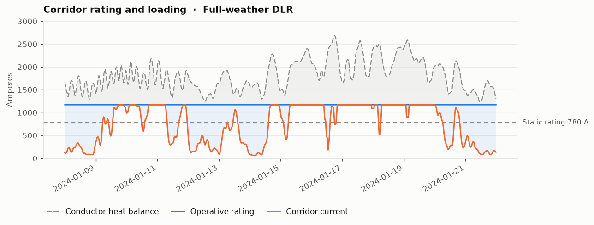

# DLR Hosting Capacity Simulator

[](https://github.com/tubnguyen/dlr-hosting-capacity-sim/actions/workflows/ci.yml)
[](https://www.python.org/)
[](LICENSE)

**How much DER can a 110 kV network host, and how much of the extra capacity dynamic line rating offers can actually
be used?**

Quasi-static AC power flow at 15-minute resolution (pandapower), IEEE 738-2012 conductor
heat balance, coordinated voltage control, a four-level constraint hierarchy and a
minimal-curtailment search. A synthetic year of data ships with the repository so it runs
out of the box, but the weather, demand, plants and network are all meant to be replaced
with your own. **[Jump to the data you need](#the-data-you-need).**

## Line rating, briefly

A line's current limit exists to keep the conductor below its design temperature (80 °C
here), and how much current reaches that temperature depends on the weather cooling it. A
static rating assumes one worst case, hot and still and sunny, all year; dynamic line
rating computes the limit from the weather the line is actually in. On a wind-heavy
network that correlates helpfully, because the congested hours are the windy ones and the
windy hours are the well-cooled ones.

The catch this tool exists to model is that the conductor is not the only thing in the
circuit. Substation equipment is not cooled by the wind, and protection settings and
clearance margins were set against the static rating, so real schemes cap the uplift at
roughly 1.3 to 1.5 times static. The tool applies all three limits, the heat balance, the
cap and the series equipment, uses the lowest and records which bound at every step.
Rating the bare conductor alone reports an uplift nobody is allowed to take.

| Mode | `--dlr` | What it needs in practice |
|---|---|---|
| Static | `0` | nothing, the nameplate rating |
| Ambient-adjusted | `1` | a temperature sensor |
| Full weather | `2` | wind measurement or forecast |

All three come from one heat balance, so the ratings are comparable rather than two
separate studies: mode 0 is that balance at the declared reference conditions, checked
against the declared 780 A to within 0.5 %.



*Dashed: what the heat balance alone allowed. Solid: what the scheme was permitted to use
once the cap and the substation equipment applied. The gap between them is headroom the
weather offered and the scheme could not take.*

## The example network

Wind and solar exporting through one congested 110 kV corridor: 41 km of ACSR (Al/St
340/30), 780 A static, 149 MVA, against 330 MW of generation, in two rating zones whose
bearings you choose. The geometry is generic, with round distances that describe no real
line: every substation or tap is 10 km from the next, and every wind farm sits on its own
20 km lateral to its tap. The one short link is the battery's tap, which sits at the
interface, 1 km from the PCC.

```
 WF_3 72MW         WF_1 90MW      WF_2 108MW
    │                       ╲     ╱
    │ 20 km           20 km  ╲   ╱ 20 km
    ▼                         ▼ ▼
  SUB_A ══════ TAP_PV ══════ TAP_W ══════ SUB_C ══════ TAP_B ══════ PCC ══> grid
    │   10 km    │    10 km        10 km        10 km    │    1 km
  load           │ PV_1 60MW                             │ BESS 30MW / 60MWh

    └──────────── zone Z1, 30 km ───────────┴──── zone Z2, 11 km ────┘
                 ══ constrained export corridor, 41 km
```

Each zone carries one mean bearing, picked from **0°, 30°, 45°, 60° or 90°** (0° runs
north–south, 90° east–west; defaults Z1 90°, Z2 60°). It sets the angle the wind meets the
line at, so it only changes the full-weather rating:

```bash
corridor-sim --dlr 2 --azimuth 45                       # both zones at 45°
corridor-sim --dlr 2 --azimuth-z1 0 --azimuth-z2 90     # one zone each way
```

Tap changers, an MV shunt reactor, plant reactive droop, a ±5 % voltage band and a
contracted export cap are all modelled, with generic parameters from public standards.
Tables in [docs/network.md](docs/network.md).

## Quickstart

```bash
git clone https://github.com/tubnguyen/dlr-hosting-capacity-sim
cd dlr-hosting-capacity-sim
pip install -e ".[dev]"

corridor-sim --preset dlr2_der4_bess --days 3   # full-weather DLR, all plants, storage
corridor-sim --preset static_der4 --days 3      # same window on a static rating
python scripts/run_matrix.py --days 30 --jobs 8 # the whole scenario matrix, in parallel
```

Runs land in `runs/<scenario>/` and are not committed. Expect them to be slow: every
timestep is a sequence of AC power flows, and a step that curtails runs a search on top of
that. On one core, roughly 20 s per simulated day when nothing binds and 2.5 minutes per
day when the corridor is curtailing heavily. `corridor-sim --help` lists every flag.

## The data you need

Four CSV files in one directory. All four are required, whichever rating mode you run.

```bash
corridor-sim --data-dir /path/to/my_data --dlr 2 --start 2024-01-01 --days 365
```

**`weather.csv` — one point representing the corridor.** Drives the rating *and* the wind
generation, so it is needed even in static mode.

| Column | Unit | What it is |
|---|---|---|
| `t_air_c` | °C | air temperature |
| `u100_ms`, `v100_ms` | m/s | wind vector at 100 m (east and north components) |
| `u10_ms`, `v10_ms` | m/s | wind vector at 10 m, so the pair gives the wind shear |
| `ghi_wm2` | W/m² | global horizontal irradiance, the sun heating the conductor |

Wind goes in as vectors rather than speed and direction because the angle against the line
decides the cooling. Reanalysis products such as ERA5 publish these exact fields; from a
met mast, convert with `u = -speed * sin(dir)` and `v = -speed * cos(dir)`.

**`load.csv` — the demand the corridor also has to carry.** Usually SCADA or metering.
With no reactive measurement, derive it from an assumed power factor; with no capacitor
bank, a column of zeros is fine.

| Column | Unit | What it is |
|---|---|---|
| `p_sub_a_mw`, `q_sub_a_mvar` | MW, MVAr | demand at the 110/20 kV substation on the corridor |
| `p_sub_b_mw`, `q_sub_b_mvar` | MW, MVAr | demand at the downstream 110/20 kV substation |
| `p_agg_mw`, `q_agg_mvar` | MW, MVAr | aggregated demand further downstream |
| `q_shunt_a_mvar` | MVAr | switched capacitor step at SUB_A |

**`pv_generation.csv` — `p_ac_mw`, the solar plant's AC export in MW.** Metered output, or
a PVGIS or pvlib simulation driven by the same irradiance you put in `weather.csv`.

**`reserve_activation.csv` — `activation_up_mw`, upward balancing energy in MW.** Only
used when the battery is enabled (`--storage`). Most TSOs publish activation history, and
zeros are a valid answer if you do not want a market layer.

**There is no wind CSV.** Farm output is modelled from `weather.csv`: hub-height
extrapolation using the shear your 10 m and 100 m fields imply, an air-density correction,
a generic 6 MW power curve, then wake and availability losses
([`ders.py`](src/corridor_sim/ders.py)). To drive the farms from measured output instead,
replace `ders.wind_dispatch()`, which returns one column of available MW per farm.

### Rules the loader enforces

* **The first column is the timestamp.** Timestamps with no zone are read as UTC, zoned
  ones are converted to UTC, and duplicates are an error.
* **Any resolution works.** Coarser series such as hourly weather are interpolated onto
  the 15-minute grid, and so are gaps inside a file.
* **Coverage is checked before interpolation**, against each file's own first and last
  timestamp, so a file that does not span your window stops the run instead of holding its
  last value flat across the gap, which would plot as a plausible calm spell. Hourly files
  therefore have to reach the closing midnight, since the grid ends at 23:45.

[`data/generate.py`](data/generate.py) builds the shipped dataset with weather, solar,
demand and reserve driven by the same processes ([data/README.md](data/README.md)).
Pairing independent series is the quiet way to build a study that never sees the
coincidences that actually cause congestion.

### Your own network

Every network and physical parameter lives in one file,
[`constants.py`](src/corridor_sim/constants.py): voltages and time step, voltage band,
conductor properties and static ratings, the rating cap, line lengths (`LEN_SEGMENT_KM`
and `LEN_WF_LATERAL_KM`), the default zone bearings and the offered set, plant ratings, transformers, control deadbands, export cap, battery and grid
strength. Topology is one readable function in
[`network.py`](src/corridor_sim/network.py). Run-level choices are `Config` fields:

```python
from corridor_sim.cli import run_scenario
from corridor_sim.config import build_config

cfg = build_config(dlr_mode=2, days=365, data_dir="/path/to/my_data",
                   azimuth_z1_deg=45.0, azimuth_z2_deg=90.0,
                   export_cap_mw=250.0, der_enabled=["WF_1", "WF_2"], label="my_case")
metrics, paths = run_scenario(cfg)
```

## Questions it answers

```bash
# which rating scheme to buy: nothing, a thermometer, or a wind measurement
corridor-sim --dlr 0 --der WF_1,WF_2,WF_3 --days 365
corridor-sim --dlr 1 --der WF_1,WF_2,WF_3 --days 365
corridor-sim --dlr 2 --der WF_1,WF_2,WF_3 --days 365

# how much the line's direction matters to the full-weather rating
corridor-sim --dlr 2 --azimuth 0 --days 365
corridor-sim --dlr 2 --azimuth 90 --days 365

# is the ceiling or the conductor the problem?
corridor-sim --dlr 2 --no-rating-cap --days 365        # if the permit were relaxed
corridor-sim --dlr 2 --no-equipment-limit --days 365   # if the switchgear were replaced

# what reconductoring would buy
corridor-sim --dlr 0 --conductor twin --der WF_1,WF_2,WF_3 --days 365
```

Compare `headroom_limited_pct` across the rating modes before costing a met mast: on the
shipped site a ceiling sets the rating more than 90 % of the year, and where that holds full-weather
DLR delivers little more than the cheaper ambient-adjusted mode. The twin bundle runs into
its switchgear rather than its conductor, the trap a reconductoring case usually misses.

There are 21 presets on the same pattern: `static_`, `dlr1_`, `dlr2_` or `twin_` for the
rating and build, then `der1` to `der4` for how many plants are connected, with a `_bess`
variant of each four-plant case, plus `baseline` with no generation at all. Disconnecting
a plant zeroes its power rather than removing it, so every scenario shares one topology
and a difference between them is a hosting-capacity difference.

## What a run writes

| File | Contents |
|---|---|
| `*_timeseries.csv` | every solved quantity per step: flows, voltages, the operative rating and what limited it, the uncapped heat balance beside it, conductor temperature, curtailment and its cause, tap and reactor operations, convergence |
| `*_violations.csv` | one row per violated interval, with level, asset and margin |
| `*_seasonal.csv` | monthly breakdown, because DLR value is strongly seasonal |
| `*_metrics.json`, `*_summary.txt` | available, delivered and curtailed energy, ratings and how often a ceiling bound, hours over each limit, actuator operations, losses; the same figures printed for a human |
| `figures/` | rating against carried current, voltage profile, rating drivers, storage operation |

## How it works

Derivations and the reasoning behind each choice: [docs/methodology.md](docs/methodology.md).

| Module | What it does |
|---|---|
| [`dlr.py`](src/corridor_sim/dlr.py) | IEEE 738 solved both ways: forward for the ampacity the weather supports at the design temperature, inverse for the temperature the carried current actually produces |
| [`controls.py`](src/corridor_sim/controls.py) | reactor first, re-solve, then the tap changer against what remains, because the same deadband on both produces a limit cycle; droop re-solves after every reactive update, so reported reactive power is a solved value |
| [`constraints.py`](src/corridor_sim/constraints.py) | four levels scanned every step: over-voltage, under-voltage (not actionable, cutting active power makes it worse), thermal by asset owner, export cap. Reporting only the first would let an under-voltage hide a thermal overload |
| [`curtailment.py`](src/corridor_sim/curtailment.py) | brackets the feasibility boundary and applies the smallest cut that clears, not the last cut tried, attributing every curtailed MWh to one cause |
| [`storage.py`](src/corridor_sim/storage.py) | intent before the solve, reconciled against the export headroom left; a battery cannot relieve an overload upstream of its tap but competes for capacity downstream |
| `network.py`, `ders.py`, `dataio.py`, `simulate.py`, `report.py`, `plots.py` | pandapower model, wind modelling, input loading, the 15-minute loop, metrics and figures |

`pytest` takes about four minutes and covers where a silent error would be most expensive:
forward and inverse solves agreeing, the declared static rating being reproduced, ratings
never exceeding their ceilings, coverage failures stopping the run, curtailment being
minimal, energy balancing every interval. CI adds a smoke run on Python 3.10 to 3.13.

## Scope and limitations

Quasi-static and intact-network: no contingency analysis, no protection or stability
study, and no sag calculation, since the design conductor temperature stands in for the
clearance limit. One weather point represents the corridor and each zone carries one mean
bearing, so a per-span rating would come out lower. Series equipment is a single lumped
rating, the administrative cap a fixed multiple rather than a forecast-dependent one, and
sensor validation, fallback ratings and dispatch latency are out of scope
([full list](docs/methodology.md#7-what-is-deliberately-not-modelled)).

The shipped dataset is a cold, windy, high-latitude site, which is where DLR has most to
offer, and never calm enough to derate below static. A site with settled winter
anticyclones would look considerably less favourable.

## License

MIT — see [LICENSE](LICENSE).
