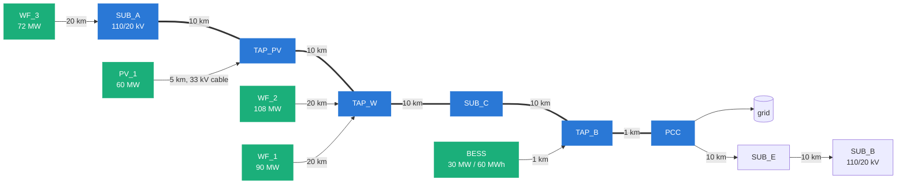

# Example network in brief

A generic 110 kV corridor exporting 330 MW of wind and solar to the grid. Values
are representative, from public standards and typical datasheets; they describe
no real line. All of them live in [`constants.py`](../src/corridor_sim/constants.py).

* **Constrained corridor:** `SUB_A → PCC`, 41 km. Zone Z1 is `SUB_A → SUB_C` (30 km),
  zone Z2 is `SUB_C → PCC` (11 km).
* **Bearings:** each zone picks 0°, 30°, 45°, 60° or 90° (defaults Z1 90°, Z2 60°).
  Only matters for full-weather rating.
* **Topology is fixed:** a disconnected plant is set to zero output, not removed,
  so every scenario shares one network.

## Corridor conductor (Al/St 340/30)

| | Single | Twin bundle |
|---|---|---|
| Name in outputs | 1-Duck | 2-Duck |
| AC resistance at 50 °C | 0.0973 Ω/km | 0.0486 Ω/km |
| Reactance | 0.400 Ω/km | 0.290 Ω/km |
| Static rating | 780 A (149 MVA) | 1560 A (297 MVA) |
| Rating cap (1.5 ×) | 1170 A | 2340 A |
| Series equipment | 1250 A | 2000 A |

Design temperature 80 °C, diameter 25 mm.

## Plants

| Plant | Rating | Connection | Reactive range |
|---|---|---|---|
| WF_1 | 15 × 6 MW = 90 MW | 20 km lateral to TAP_W | ±29.6 MVAr |
| WF_2 | 18 × 6 MW = 108 MW | 20 km lateral to TAP_W | ±35.5 MVAr |
| WF_3 | 12 × 6 MW = 72 MW | 20 km lateral to SUB_A | ±23.7 MVAr |
| PV_1 | 60 MW | 110/33 kV + 5 km cable at TAP_PV | ±19.7 MVAr |
| BESS | 30 MW / 60 MWh | 110/33 kV + 1 km tie at TAP_B | ±9.9 MVAr |

Reactive range is cos φ 0.95 at rated power.

## Transformers

| Asset | Rating | Impedance | Taps |
|---|---|---|---|
| T_SUB_A1 / T_SUB_A2 | 25 / 16 MVA, 110/20 kV | 10.4 / 10.2 % | on-load, ±9 × 1.67 % |
| T_SUB_B | 25 MVA, 110/20 kV | 9.7 % | on-load, ±9 × 1.67 % |
| Wind step-up (2 per farm) | 50 MVA ONAN / 63 MVA ONAF | 12.5 % | fixed |
| T_PV / T_BESS | 75 / 40 MVA, 110/33 kV | 12.0 % | fixed |

## Limits and settings

| | Value |
|---|---|
| Voltage band | 0.95 – 1.05 pu |
| Export cap at the PCC | 250 MW |
| Reactive exchange window | ±33 MVAr |
| Reactive import guard | 20 MVAr |
| Grid impedance behind the PCC | 2.0 + j10.0 Ω |
| MV tap-changer setpoint | 20.5 kV |
| MV shunt reactor | 11 steps, 0.50 – 3.00 MVAr |
