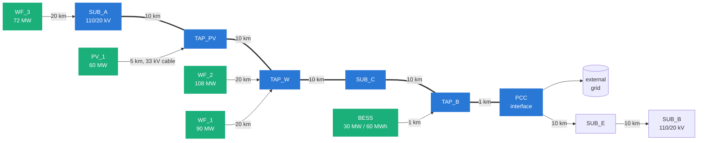

# The study corridor

A generic 110 kV sub-transmission corridor connecting a cluster of generation to
a stronger transmission network. All parameters are representative values from
public standards and typical datasheets.

The heavy path `SUB_A → PCC` is the constrained export corridor: everything the
plants generate reaches the grid through it. It is 41 km long and split into
two rating zones, `Z1` (`SUB_A → SUB_C`, 30 km) and `Z2` (`SUB_C → PCC`, 11 km).

### Distances and bearings

The geometry is deliberately generic and describes no real line. Every
substation or tap is **10 km** from its neighbour on the 110 kV network, and
every wind farm sits on its own **20 km** 110 kV lateral to the tap it exports
through. The short connections are the battery's: its tap, `TAP_B`, sits 1 km
from the PCC busbar, and a 1 km tie joins it to the battery substation. The
battery is meant to act at the interface, and with 10 km of line between the two
the corridor's reactive loss at full export is more than the plant droop can
settle. The solar collector is a 5 km 33 kV cable. All of these live in
[`constants.py`](../src/corridor_sim/constants.py) (`LEN_SEGMENT_KM`,
`LEN_WF_LATERAL_KM`, `LEN_INTERFACE_TAP_KM` and the per-line names).

Each rating zone carries one mean bearing, the azimuth of the line in degrees
clockwise from north, which sets the angle the wind meets it at in full-weather
mode. It is chosen per run from a fixed set of round values:

| Azimuth | Line runs |
|---|---|
| 0° | north – south |
| 30° | north-north-east |
| 45° | north-east |
| 60° | east-north-east |
| 90° | east – west |

The defaults are `Z1` 90° and `Z2` 60°. Set both with `--azimuth 45`, or each
zone on its own with `--azimuth-z1` and `--azimuth-z2`; in Python, the
`azimuth_z1_deg` and `azimuth_z2_deg` Config fields. Any other value is
rejected. The bearing only matters in full-weather mode (`--dlr 2`): the static
and ambient-adjusted modes assume perpendicular wind whatever the line's
direction.

## Ratings and parameters

### Corridor conductor

Al/St 340/30 to DIN 48204: 339 mm² aluminium over 30 mm² steel, 25.0 mm outside
diameter, 0.0851 Ω/km DC at 20 °C, 80 °C design temperature. Datasheet values,
so the conductor description and the numbers used are the same conductor and
both can be checked against a published table.

| | Single | Twin bundle |
|---|---|---|
| AC resistance at 50 °C | 0.0973 Ω/km | 0.0486 Ω/km |
| Reactance | 0.400 Ω/km | 0.290 Ω/km |
| Capacitance | 9.2 nF/km | 12.6 nF/km |
| Static rating | 780 A | 1560 A |
| Corridor capability | 149 MVA | 297 MVA |
| Administrative rating cap (1.5 ×) | 1170 A | 2340 A |
| Series equipment rating | 1250 A | 2000 A |

Resistance is AC, not DC: skin effect at 50 Hz raises the effective value by
about 2 % on a conductor this size, and because ampacity goes as 1/√R, ignoring
it overstates the rating by roughly 1 %.

The static rating is not an independent figure. It is what the IEEE 738 model
returns at the reference conditions the rating is declared for, which is what
makes the static and dynamic modes the same physics rather than two models.

Against a 330 MW fleet, the single conductor is the binding constraint by more
than a factor of two — which is the point of the study.

### What limits the corridor besides the conductor

The heat balance rates the conductor. Two limits sit above it, and on this
corridor one of them binds most of the time.

**The administrative cap.** A dynamic rating is granted against protection
settings, sag and clearance margins and a permit that were all established for
the static rating. Operators therefore cap the uplift at a fixed multiple
rather than following the heat balance wherever the weather takes it. Published
deployments sit around 1.3 to 1.5; 1.5 is used here and is configurable
(`--dlr-cap-ratio`, or `--no-rating-cap` to rate the bare conductor).

**The series equipment.** Current reaching the line passes through current
transformers, disconnectors, terminations and jumper loops in the substation.
None of it is cooled by the wind, and all of it carries its own nameplate from
the IEC 62271 standard rating series — 630, 800, 1250, 1600, 2000, 2500,
3150 A — so it steps rather than tracking the conductor. A line rated 780 A is
normally built with 1250 A plant. In practice this is what stops a DLR scheme
before the conductor does, and it is the most common reason a study's headline
uplift is not realisable.

Which of the three ceilings bound is recorded per zone and per timestep
(`rating_{zone}_binding`), because *the weather did not allow more* and *the
weather allowed more and we were not permitted to use it* are different study
results with different remedies.

### Generation

| Plant | Rating | Connection | Reactive capability |
|---|---|---|---|
| WF_1 | 15 × 6 MW = 90 MW | 20 km 110 kV lateral to TAP_W | ±29.6 MVAr |
| WF_2 | 18 × 6 MW = 108 MW | 20 km 110 kV lateral to TAP_W | ±35.5 MVAr |
| WF_3 | 12 × 6 MW = 72 MW | 20 km 110 kV lateral to SUB_A | ±23.7 MVAr |
| PV_1 | 60 MW | 110/33 kV substation + 5 km 33 kV cable | ±19.7 MVAr |
| BESS | 30 MW / 60 MWh | 110/33 kV, 1 km tie | ±9.9 MVAr |

Reactive capability is the cos φ 0.95 grid-code minimum at rated active power.
The battery is four-quadrant and supplies reactive power at zero active power.

### Transformers

| Asset | Rating | Impedance | Tap changer |
|---|---|---|---|
| T_SUB_A1 | 25 MVA, 110/20 kV | 10.4 % | on-load, ±9 × 1.67 % |
| T_SUB_A2 | 16 MVA, 110/20 kV | 10.2 % | on-load, ±9 × 1.67 % |
| T_SUB_B | 25 MVA, 110/20 kV | 9.7 % | on-load, ±9 × 1.67 % |
| Wind step-up (×2 per farm) | 50 MVA natural / 63 MVA forced | 12.5 % on the 50 MVA base | fixed |
| T_PV | 75 MVA, 110/33 kV | 12.0 % | fixed |
| T_BESS | 40 MVA, 110/33 kV | 12.0 % | fixed |

Each wind farm has two parallel step-up units. Nameplate impedance is quoted on
the natural-cooling base and re-referred to whichever rating is enforced, so
switching between the two changes the loading percentage without changing the
network impedance — the two cases stay directly comparable. `wf_trafo_units=1`
gives the single-unit outage case.

### Limits

| | Value |
|---|---|
| Voltage band | 0.95 – 1.05 pu |
| Export cap at the interface | 250 MW |
| Reactive exchange window | ±33 MVAr (10 % of installed capacity) |
| Reactive import guard (releases the reactors) | 20 MVAr |
| External grid Thevenin impedance | 2.0 + j10.0 Ω |
| MV tap-changer setpoint | 20.5 kV |
| Shunt reactor | 11 steps, 0.50 – 3.00 MVAr |

## Topology invariance

Every element is built on every run. Disconnecting a plant sets its power to
zero rather than removing it from the network, so every scenario in the matrix
shares one topology and the comparison between them is clean. The alternative —
building a different network per scenario — makes it impossible to tell a
hosting-capacity difference from a topology difference.
